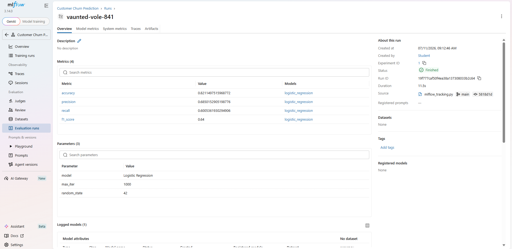
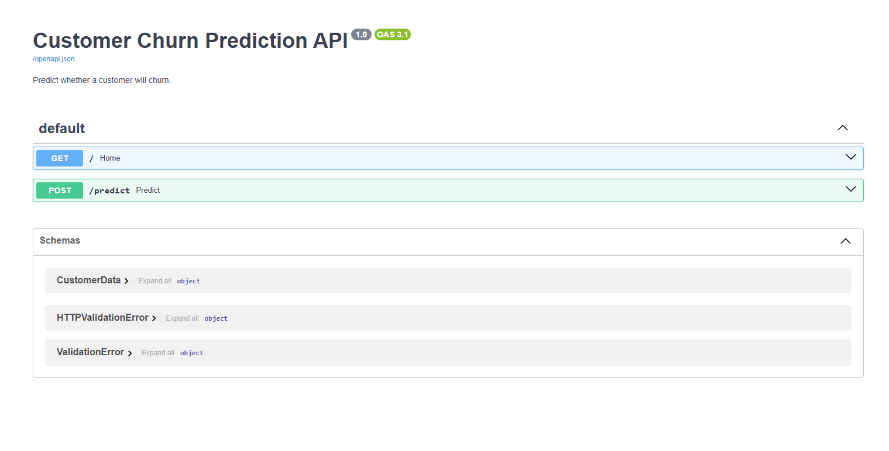

# 🚀 End-to-End Customer Churn Prediction using Machine Learning

## 📖 Project Overview

This project predicts whether a telecom customer is likely to churn based on customer demographics, account information, and service usage. It demonstrates a complete Machine Learning workflow, from data preprocessing and model training to experiment tracking, API development, Docker containerization, and cloud deployment using Render.

---


---

## 🌐 Live Demo

- **API:** https://customer-churn-prediction-1-wczr.onrender.com
- **Swagger UI:** https://customer-churn-prediction-1-wczr.onrender.com/docs

---

## 📌 Features

- Data Cleaning & Preprocessing
- Exploratory Data Analysis (EDA)
- Feature Engineering
- Scikit-learn Pipeline
- Logistic Regression Model
- MLflow Experiment Tracking
- FastAPI REST API
- Swagger UI Documentation
- Docker Containerization
- Ready for Render Deployment

---

## 🛠 Tech Stack

- Python
- Pandas
- NumPy
- Scikit-learn
- MLflow
- FastAPI
- Pydantic
- Docker
- Git & GitHub
- AWS Elastic Beanstalk (Next)

---

## 📂 Project Structure

```
CUSTOMER_CHURN_PREDICTION
│
├── app
│   ├── main.py
│   ├── predictor.py
│   └── schema.py
│
├── artifacts
├── data
├── models
│   └── churn_pipeline.pkl
│
├── notebooks
├── src
│
├── Dockerfile
├── requirements.txt
├── README.md
└── .dockerignore
```

---

## ⚙️ Installation

Clone the repository

```bash
git clone https://github.com/SHRADDHA-D-S/Customer-Churn-Prediction.git
```

Move into the project

```bash
cd Customer-Churn-Prediction
```

Create virtual environment

```bash
python -m venv venv
```

Activate environment

Windows

```bash
venv\Scripts\activate
```

Install dependencies

```bash
pip install -r requirements.txt
```

---

## ▶️ Run FastAPI

```bash
uvicorn app.main:app --reload
```

Open

```
http://127.0.0.1:8000/docs
```

---

## 🐳 Docker

Build Image

```bash
docker build -t customer-churn-api .
```

Run Container

```bash
docker run -p 8000:8000 customer-churn-api
```

---

## 📊 MLflow

Run

```bash
python src/mlflow_tracking.py
```

Start MLflow UI

```bash
mlflow ui
```

Open

```
http://127.0.0.1:5000
```

---

## 📊 Model Performance

| Metric | Score |
|---------|-------|
| Accuracy | 82.11% |
| Precision | 68.50% |
| Recall | 60.05% |
| F1 Score | 64.00% |

---

## 🎯 API Endpoint

POST

```
/predict
```

Returns

```json
{
  "Prediction": "Yes"
}
```

or

```json
{
  "Prediction": "No"
}
```

---

## 📷 MLflow Dashboard



---

## 📷 Swagger UI



---

## 📷 Prediction API


---

## 🐳 Docker


---

## 📈 Future Improvements

- Train and compare multiple ML models
- Hyperparameter tuning using GridSearchCV
- CI/CD pipeline with GitHub Actions
- Deploy on AWS Elastic Beanstalk
- Build a Streamlit dashboard
- Real-time prediction monitoring

---

## 🏆 Project Highlights

- End-to-End Machine Learning Pipeline
- REST API using FastAPI
- Dockerized Application
- MLflow Experiment Tracking
- Live Deployment on Render
- Version Controlled using Git & GitHub
- Successfully deployed on Render using Docker

---

## 👩‍💻 Author

**Shraddha D S**

GitHub: https://github.com/SHRADDHA-D-S

LinkedIn: https://www.linkedin.com/in/shraddha-d-s
